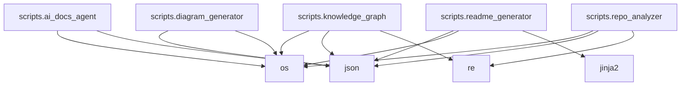

# FACE-EMOTION-DETECTION


## Auto-Generated Documentation
This repository is self-documenting. The structural analysis, diagrams, and README are updated automatically via GitHub Actions and AI Agents.

## Technology Stack

### Languages

- Python


### Frameworks & Libraries

- Django

- FastAPI

- Flask

- React

- Express


## Repository Structure
```

📁 scripts

```

## Environment Variables
The following environment variables are detected as being used:

- `OPENAI_API_KEY`


## Architecture & Dependencies
The following diagram is automatically generated from the codebase:




## Setup Instructions
1. Clone the repository.
2. Install the necessary dependencies based on the languages and frameworks listed above.
3. Configure the environment variables.
4. Run the appropriate start command for your framework.

## Contribution
Please refer to the open issues and pull requests. AI Agents will assist with documentation updates on your PRs.