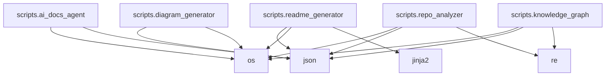

# Dependency Graph

```mermaid
graph TD;
    scripts_readme_generator["scripts.readme_generator"];
    click scripts_readme_generator "scripts/readme_generator.py" "View source";
    json["json"];
    os["os"];
    jinja2["jinja2"];
    scripts_ai_docs_agent["scripts.ai_docs_agent"];
    click scripts_ai_docs_agent "scripts/ai_docs_agent.py" "View source";
    scripts_diagram_generator["scripts.diagram_generator"];
    click scripts_diagram_generator "scripts/diagram_generator.py" "View source";
    scripts_repo_analyzer["scripts.repo_analyzer"];
    click scripts_repo_analyzer "scripts/repo_analyzer.py" "View source";
    re["re"];
    scripts_knowledge_graph["scripts.knowledge_graph"];
    click scripts_knowledge_graph "scripts/knowledge_graph.py" "View source";
    scripts_readme_generator --> json;
    scripts_readme_generator --> os;
    scripts_readme_generator --> jinja2;
    scripts_ai_docs_agent --> os;
    scripts_ai_docs_agent --> json;
    scripts_diagram_generator --> json;
    scripts_diagram_generator --> os;
    scripts_repo_analyzer --> os;
    scripts_repo_analyzer --> json;
    scripts_repo_analyzer --> re;
    scripts_knowledge_graph --> os;
    scripts_knowledge_graph --> json;
    scripts_knowledge_graph --> re;
```
